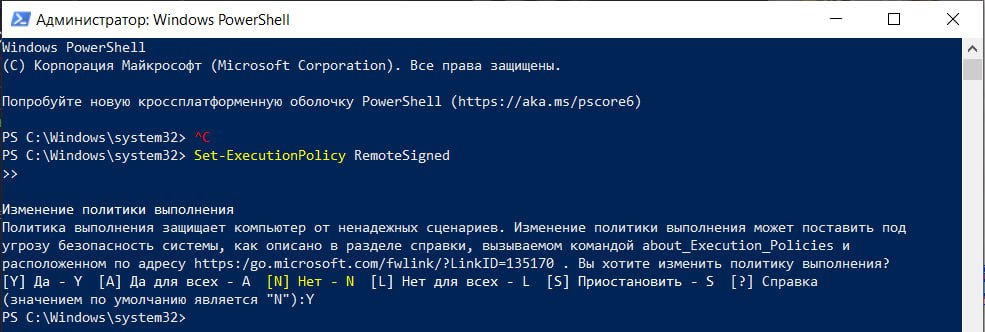
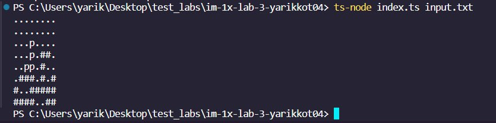

# Lab 3 Tetris
> Student: Котенко Ярослав
> Group: IM-13

**Task:**

Implementation of a game logic similar to Tetris. The task includes reading the initial screen state from a file, displaying the screen state after a piece falls, dividing the program into logical, input/output, and communication layers using Dependency Injection (DI). It is necessary to create a data structure for storing the game field, functions for handling piece falls and displaying the field state, and to include testing of all layers using mock objects for testing the communication layer.

**Tech stack:**

- Programming language: TypeScript. A superset of JavaScript that adds strong typing and object-oriented features, making the code more structured and understandable. Additionally, integrated ts-node for executing TypeScript code directly, and @types/node for Node.js API typing support.
- Testing: Jest. Also suitable for TypeScript.

## How to run
---
## Linux
Install all the dependencies:
```
npm i
```
Install ts-node dependency globally
```
npm i ts-node -g
```
Run all tests together:
```
npm run test
```
Run only mock tests:
```
npm run testMock
```
Run only IO tests:
```
npm run testIO
```
Run only logic tests:
```
npm run testLogic
```
Start the program: 
```
ts-node index.ts input.txt
```
## Windows
If you have not previously installed ts-node on Windows, problems may arise.

### How to fix:
1) Install ts-node dependency globally
```
npm i ts-node -g
```
2) Then you need to open PowerShell as an Administrator and enter the command shown in the image.



3) Next, navigate to the project folder and enter the command depicted in the image.




