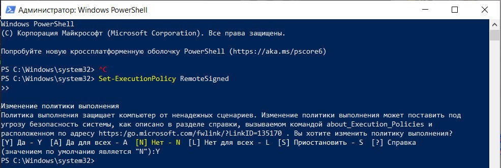
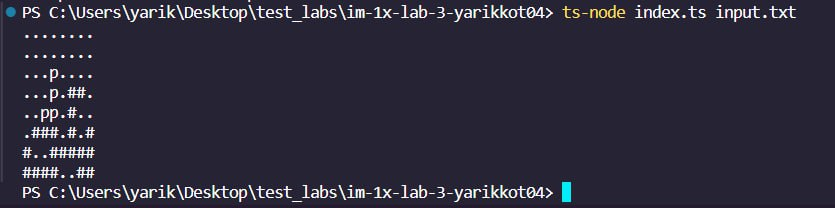

# Lab 4 Tetris++
> Student: Котенко Ярослав

> Group: IM-13

**Task:**

The task of the laboratory work is to develop a program from the previous lab assignment, adding functionality to output not only the last screen of the game but also screens for each step of the game. It is necessary to preserve the initial mode of operation of the program (output only the last screen) and add a parameter that allows outputting all game steps. Also, it is necessary to apply a library for working with test doubles, replacing the mock objects created in Lab 3 with mock objects from this library.

**Tech Stack:**

- Programming Language: TypeScript.
- Testing: Jest.

## How to run
---
## Linux
Install all the dependencies:
```
npm i
```
Install ts-node dependency globally
```
npm i ts-node -g
```
Run all tests together:
```
npm run test
```
Run only mock tests:
```
npm run testMock
```
Run only IO tests:
```
npm run testIO
```
Run only logic tests:
```
npm run testLogic
```
Start the program: 
```
ts-node index.ts input.txt
```
## Windows
If you have not previously installed ts-node on Windows, problems may arise.

### How to fix:
1) Install ts-node dependency globally
```
npm i ts-node -g
```
2) Then you need to open PowerShell as an Administrator and enter the command shown in the image.



3) Next, navigate to the project folder and enter the command depicted in the image.



